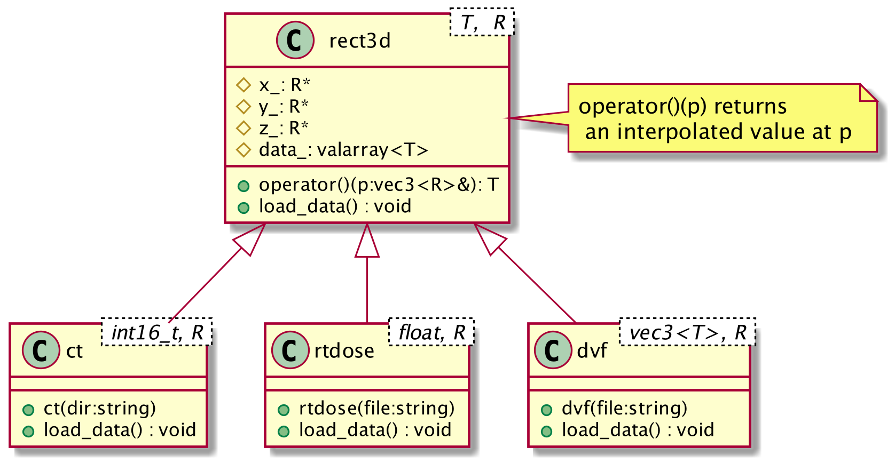
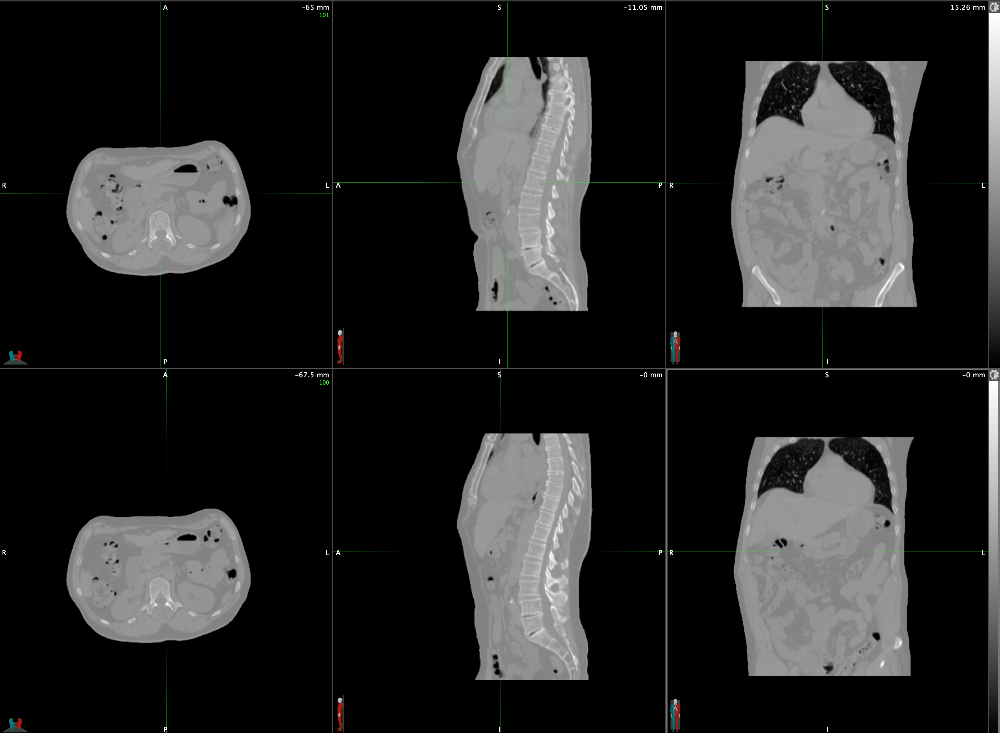
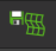
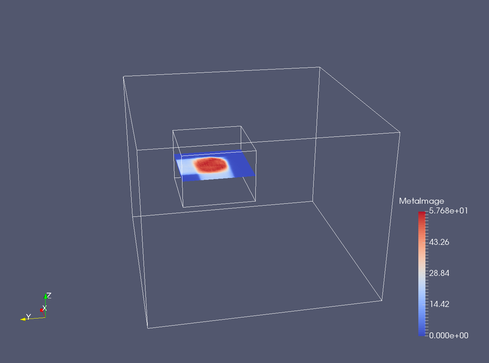
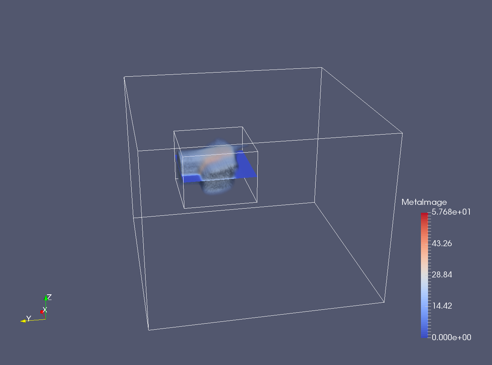
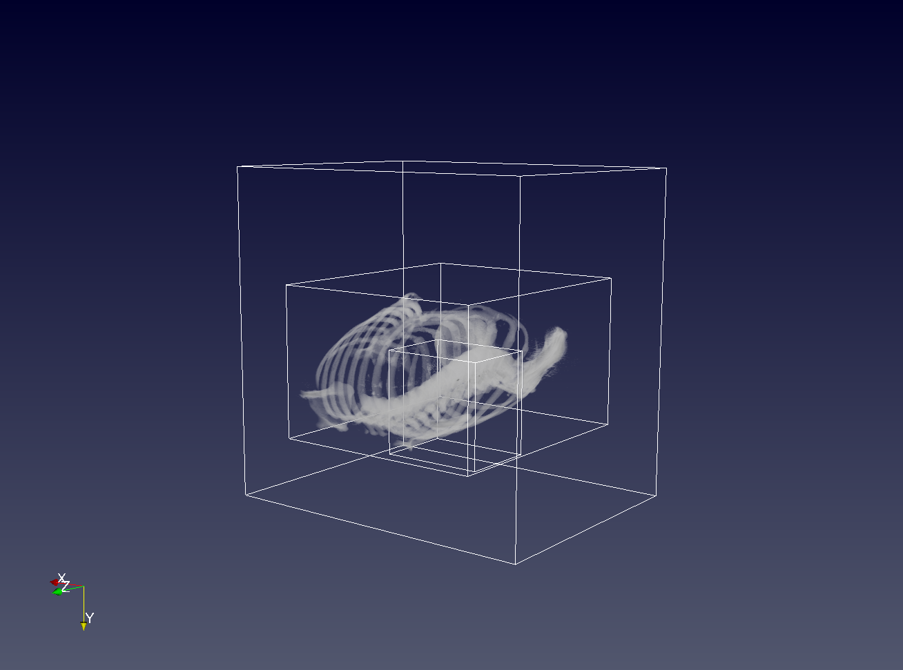
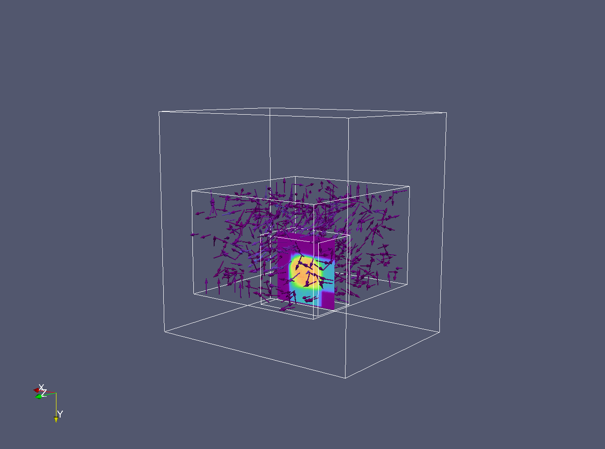
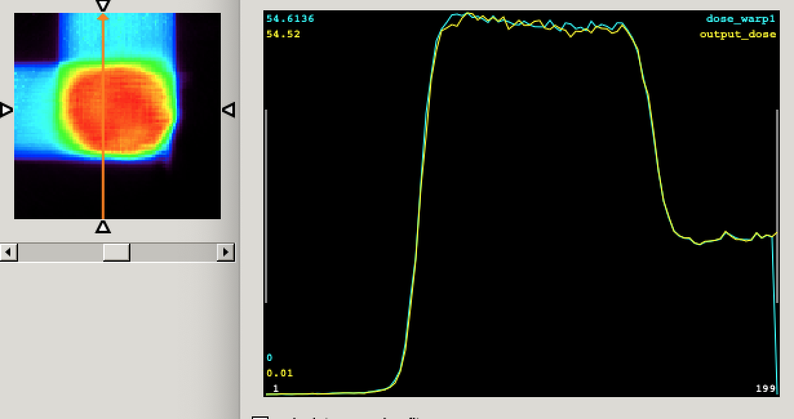

# dvf
Dose warping implementation using deformation vector field (DICOM)

## Class design

Class to represent a type of 3D rectangles, CT, RTDOSE, and DVF is written.



Among interpolation algorithms such as Trilinear, Prismatic, Pyramid, Tetrahedra, Nearest neighbor, etc., Trilinear is implemented.


## How to compile 

- Library dependencies: gdcm (2.6.x) 
- compiler: 
    - For Mac, Apple LLVM version 10.0.1 (clang-1001.0.46.3).
    - For Linux, never tested

```

$ cmake .
$ make 
$ ./dvf --ctdir <your_ct_dir_path> --dosefile <your_rtdose_file> --dvffile <your_dvf_file> 

```


## Getting DVF from MIM

- Load Two image series using MIM


- Click fuse icon 

- Then MIM will show at bottom (be careful which one is moving or fixed)
The seriese you click first will be the reference.


- Click DIR button 

- Then there will be a new CT that is deformed (top row).
- 

- Click Save DIR 

Then a DICOM file is created. For the detail of the file see:

http://dicom.nema.org/MEDICAL/dicom/2017b/output/chtml/part03/sect_C.20.3.html

## Example code (dvf_smc.cpp)


```c++
//ctdir
std::string dname = cl_opts["--ctdir"][0];
rti::ct<float> myct(dname);
myct.load_data();

//rtdose
std::string fname = cl_opts["--dosefile"][0];
rti::rtdose<float> mydose(fname);
mydose.load_data();

//dvf file
std::string dvfname = cl_opts["--dvffile"][0];
rti::dvf<float, float> mydvf(dvfname);
mydvf.load_data();

//Create empty grids
rti::rect3d<float,float>  dose_grid;
rti::rect3d<float,float>  ct_grid;
rti::rect3d<float,float>  dvf_grid;

//Copy various grid structures to empty grids
rti::clone_structure(mydose, dose_grid);
rti::clone_structure(myct, ct_grid);
rti::clone_structure(mydvf, dvf_grid);

float fill_value = 0.0;

//Write dose to various grid
rti::interpolate(mydose, dose_grid, fill_value); //interpolate dose on DOSE grid
rti::interpolate(mydose, ct_grid,   fill_value); //interpolate dose on CT grid
rti::interpolate(mydose, dvf_grid,  fill_value); //interpolate dose on DVF grid
    
```


```
CT (nx,ny,nz): (512, 512, 200)
CT (dx,dy,dz): (1.26953, 1.26953, 2.5)
CT (x,y,z): (-325, -325, -317.5)
RTDOSE (nx,ny,nz): (100, 100, 60)
RTDOSE (dx,dy,dz): (2, 2, 2.5)
RTDOSE (x,y,z): (-181.1, 7.4, -47.55)
DVF (nx,ny,nz): (144, 101, 161)
DVF (dx,dy,dz): (2.9975, 2.99157, 2.99689)
DVF (x,y,z): (-211.148, -104.51, 162.252)
```
It took < 1 sec to load CT, RTDOSE, and DVF on mac i5 3.5 Ghz and 3.5 secs to perform all interpolation.

| CT grid and DOSE grid (small)| Doses interpolated to CT grid and DOSE grid |
|:---:|:---:|
|||


| Grid (CT, DVF, DOSE) alignment with CT | Grid (CT, DVF, DOSE) alignment with DVF and dose |
|:---:|:---:|
|||

Here are the conversion result (including interpolation step)

| source | destination | success/fail | comment |
|--------|:------:|:-----:|:----|
| CT |  CT  | FAIL | needs fix (not high priority), interpolation with int? |
| CT |  RTDOSE  | FAIL |  |
| CT |  DVF  | FAIL |  |
| DOSE |  CT  | SUCCESS |  |
| DOSE |  RTDOSE  | SUCCESS |  |
| DOSE |  DVF  | SUCCESS |  |
| DVF |  CT  | SUCCESS |  |
| DVF |  RTDOSE  | SUCCESS |  |
| DVF |  DVF  | SUCCESS |  |


## Dose warping

The dose warping is implemented. 
Dose of source (moving phase) is pulled from the destination grid. 

Based on the point calculated from vector field,  8 points enclosing the translated point are found, and then dose is interpolated.




Plastimatch uses its own implementation or uses itk::WarpImageFilter

https://itk.org/Doxygen/html/classitk_1_1WarpImageFilter.html

